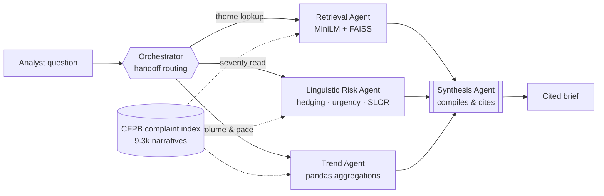

# Bank Complaint Intelligence Agent

A five-agent Semantic Kernel system that turns the public **CFPB Consumer
Complaint Database** into analyst-grade briefs — combining semantic retrieval, a
psycholinguistic risk score, and trend analysis under handoff-based routing.

Ask it a question in plain language:

> *"What are Wells Fargo customers most frustrated about with overdraft fees in
> the last two quarters, and how urgent does the language sound?"*

…and an Orchestrator routes the work to three specialists, then a Synthesis
agent compiles their findings into a short brief where **every claim carries a
complaint ID**.

Everything runs on genuinely free infrastructure. No credit card anywhere in the
chain.

---

## Architecture



The Orchestrator holds no data tools — it only decides *who* works on a
question. Specialists can hand back to it for re-routing or straight on to
Synthesis when the question is already answered, so a simple lookup skips a
routing round-trip.

| Agent | Owns | Tools |
| --- | --- | --- |
| **Orchestrator** | Intent classification and routing | `transfer_to_*` only |
| **Retrieval Agent** | The complaint index — the only agent that reads it | `search_complaints`, `dataset_scope` |
| **Linguistic Risk Agent** | Severity of complaint *language* | `score_complaints`, `score_text`, `severity_profile` |
| **Trend Agent** | Volume, issue mix, quarter-over-quarter movement | `complaint_volume`, `quarter_over_quarter`, `top_issues`, `rising_issues` |
| **Synthesis Agent** | The final brief | none — judgement only |

---

## The part that isn't a RAG wrapper

Most "AI complaint triage" demos ask an LLM how angry a complaint sounds. That
answer is unreproducible and unauditable — two things a bank cannot accept.

`nlp/linguistic_risk.py` scores each narrative with explicit, inspectable
features instead, extending coursework in computational psycholinguistics:

| Feature | What it captures |
| --- | --- |
| `urgency` | temporal-pressure and immediacy markers |
| `intensity` | negative-affect lexicon, intensifiers, shouting (caps), `!` density |
| `escalation` | legal and regulatory threat vocabulary |
| `harm` | concrete financial consequences — foreclosure, NSF, credit score |
| `repetition` | evidence of repeated, unresolved contact attempts |
| `hedging` | epistemic hedges — these **lower** the score (see below) |
| `disfluency` | low SLOR relative to the corpus |

**SLOR** (Syntactic Log-Odds Ratio — Pauls & Klein 2012; Lau, Clark & Lappin
2017) is the standard length- and frequency-controlled fluency measure:

```
SLOR(s) = ( log P_LM(s) − log P_unigram(s) ) / |s|
```

Subtracting the unigram term stops a sentence being penalised merely for
containing rare words; dividing by length stops long complaints scoring
differently from short ones. `P_LM` here comes from an add-k smoothed **bigram
model fitted on the complaint corpus itself** — cheap, dependency-free and
reproducible on a free CPU box, where a neural LM would not be. Narratives
scoring well below the corpus mean are disfluent relative to their peers, which
in written complaints tracks distress and haste.

Three design decisions worth defending in an interview:

**Hedging dampens rather than adds.** "I think there *may possibly* have been a
small error" is not an urgent complaint however annoyed the writer is. Heavy
hedging signals low speaker commitment, so it multiplies the score down by up to
25%. This is what separates *loud* from *urgent* — the distinction that actually
drives triage.

**Severity bands are calibrated, not absolute.** Consumer complaints run long, so
marker *rates* per 100 tokens are low and fixed cut-points put almost everything
in the bottom band — the first build scored 4 complaints out of 9,324 as high.
`data.ingest` now sets the bands from the corpus distribution (70th and 92nd
percentile), and every score is reported with its corpus percentile alongside the
raw value. "Top decile of urgency for this book of complaints" is an actionable
statement; "34 out of 100" is not.

**Every driver is traceable.** A score comes back with the exact tokens that
produced it, so a reviewer can disagree with the evidence rather than with a
black box.

---

## Two execution modes

`agents/orchestrator.py` runs the same five agents two ways:

- **`handoff`** — Semantic Kernel's `HandoffOrchestration`. The routing model
  decides which specialists to involve and in what order. This is the pattern
  the project is about.
- **`pipeline`** — a deterministic retrieval → risk → trend → synthesis
  sequence with no routing model in the loop.

`auto` (the default) runs handoff and falls back to pipeline if it fails or
returns nothing usable. This isn't a theoretical hedge — it's load-bearing:
handoff mode depends on a routing model reliably calling the right function at
every step, and a live model doesn't always cooperate (see below). The UI
shows which mode actually produced the answer, plus a note when it had to
fall back.

### Routing silently skipped

The single most persistent failure across this project — "Task is completed
with summary: No handoff agent name provided..." — comes down to
`FunctionChoiceBehavior.Auto()` genuinely *permitting* an agent to answer in
plain text instead of calling a tool, with no prompt wording forcing
compliance. It's a real option the model is free to take. The fix isn't a
patch, it's a policy change: [agents/kernel_setup.py](agents/kernel_setup.py)
runs the Orchestrator and all three specialists — every one of which is
designed to always end its turn by calling a domain tool or a `transfer_to_*`
— with `FunctionChoiceBehavior.Required()` instead, which maps to Gemini's
`function_calling_config.mode = "ANY"`, a genuinely forced tool call.
SynthesisAgent is the deliberate exception — its entire job is answering in
prose, so it keeps `Auto()`.

Two structural gaps compounded this, both real bugs independent of the model:
every specialist's prompt covered routing to *another specialist* for more
analysis, but never covered "I have nothing further to add" — so a specialist
invoked a second time (e.g. Retrieval, asked to fetch examples for a trend
Trend already found) would just summarize in prose and end the run with no
transfer at all. And SynthesisAgent had *zero* outgoing edges in the handoff
graph despite the Orchestrator being allowed to route to it as the very first
move — so if that happened before any specialist had gathered real evidence,
Synthesis's only option was to give up via `complete_task` with no way to ask
for real routing first. Both are fixed now: every specialist is explicitly
told to close out to Synthesis, and Synthesis can hand back to the
Orchestrator when it's reached with nothing to work with.

Even with forcing in place, a specialist invoked as part of a multi-part
question can pick just one of its clauses to act on and route past the rest —
confirmed live, "which issues are growing fastest, **and how severe is the
language**" got routed to volume analysis only, and the brief's severity
section ended up written from no real scoring at all. The Orchestrator's
routing rules now explicitly call out treating each clause of a multi-part
question as its own routing decision, and RetrievalAgent is told which
specialist depends on its own output (LinguisticRiskAgent) so it doesn't skip
past it to whichever specialist is otherwise easier to hand off to.

### Citations are attached by code, never written by the model

Synthesis used to be asked to write a complaint ID at the end of every theme
it described. A model under pressure to satisfy "every theme needs an ID"
will sometimes invent a plausible-looking number instead of admitting it has
none — confirmed live, repeatedly, with different fake IDs each time,
including after the prompt was tightened more than once to explicitly forbid
it. Prompting alone doesn't reliably prevent it, because RAG only puts real
documents in the model's context — it doesn't stop the model from generating
something that was never actually retrieved.

Synthesis no longer writes IDs at all. It describes each theme in plain
prose, and `agents/orchestrator.py`'s `_attach_citations` matches that
description's own wording against whatever was genuinely retrieved this
session — deterministic keyword overlap, not another model call — and inserts
the real ID afterward. A theme with no confident match is explicitly marked
`[no closely-matching complaint found]` rather than left silently uncited
(which would look identical to a properly-cited one) or backed by a weak
guess. The result: every complaint ID on screen is guaranteed real, and every
gap is honestly flagged instead of papered over.

## Running it

```bash
git clone <this repo> && cd bank-complaint-agent
python -m venv .venv && .venv/Scripts/activate     # Linux/macOS: source .venv/bin/activate
pip install -r requirements.txt

python -m data.fetch_cfpb      # pulls ~10k complaints from the CFPB API (no key needed)
python -m data.ingest          # cleans, fits the corpus LM, scores, embeds, builds FAISS

export GOOGLE_AI_API_KEY=...   # free key: https://aistudio.google.com
python app.py                  # http://localhost:7860
```

The **Explore** and **Dashboard** tabs work with no API key at all — semantic
search and the risk scorer are entirely local. Only the agent team needs a
Google AI Studio key.

Useful flags:

```bash
python -m data.fetch_cfpb --list-companies schwab   # resolve exact CFPB company names
python -m data.fetch_cfpb --company "STATE FARM BANK, FSB" --max 2000
python -m data.ingest --rebuild --reuse-embeddings  # re-score without re-embedding
python -m agents.orchestrator "Are Amex disputes getting worse?"
```

Scope lives in [`config.py`](config.py) — companies, date window and the
minimum narrative length.

---

## Tech stack

| Layer | Choice | Cost |
| --- | --- | --- |
| Data | CFPB Complaint Database API | $0 · no key |
| Embeddings | `all-MiniLM-L6-v2`, local | $0 |
| Vector index | FAISS `IndexFlatIP` (cosine, exact) | $0 |
| Orchestration | Semantic Kernel (Python) | $0 |
| LLM | Google AI Studio · Gemini | $0 free tier |
| App | Gradio | $0 |
| Hosting | Render, free Python web service | $0 |

Free tiers were a deliberate constraint, not a limitation — they force the
design decisions that make the system defensible: local deterministic scoring
instead of LLM-judged severity, exact search instead of an approximate index
that needs tuning, and a fallback path for when the inference tier rate-limits.

---

## Deploying

**Hugging Face Spaces now requires a paid (Pro) plan to create a Gradio or
Docker Space** — only Static Spaces are free (verified against HF's own docs;
this changed at some point after this project's spec was written, when Spaces
were free on CPU Basic hardware regardless of SDK). The one free-tier
exception, ZeroGPU, doesn't fit here: it requires an account older than 30
days and exists for GPU-bound demos, not this app's CPU-only workload. If you
have HF Pro already, the original steps still work:

1. **New Space → Gradio SDK → CPU Basic**.
2. Push this repo to the Space, or connect the GitHub repo directly.
3. Add `GOOGLE_AI_API_KEY` under **Settings → Variables and secrets**. Never commit it.
4. The built index in `index/` is committed (~33 MB), so the Space boots without
   re-fetching CFPB data. `index/embeddings.npy` is *not* committed — those
   vectors already live inside `complaints.faiss` and are reconstructed at load
   time. To keep the repo lean instead, uncomment `index/` in `.gitignore` and
   run the two build commands on first boot — expect a slow cold start.
5. Free Spaces sleep when idle. Open the link a minute before demoing.

### Deploying for free instead — Render

[Render](https://render.com)'s free tier hosts a native Python web service (no
Docker required), with no card needed to get started:

1. Push this repo to GitHub (see below), then at [render.com](https://render.com):
   **New → Web Service → connect the GitHub repo**.
2. **Build command:** `pip install -r requirements.txt`
   **Start command:** `python app.py`
   (`app.py` already reads Render's `PORT` env var — see [app/app.py](app/app.py).)
3. Add `GOOGLE_AI_API_KEY` under the service's **Environment** tab.
4. Render's free tier spins the service down after 15 minutes idle and takes
   about a minute to wake back up on the next request — the same "warm it up
   before demoing" tradeoff as HF's free tier, on a host that doesn't require
   a paid plan to run a Gradio app at all.

---

## Repo layout

```
bank-complaint-agent/
├── config.py                  # paths, dataset scope, model ids
├── app.py                     # HF Spaces entry point
├── data/
│   ├── fetch_cfpb.py          # pulls & caches complaints from the CFPB API
│   └── ingest.py              # cleaning, LM fit, scoring, FAISS build + ComplaintIndex
├── nlp/
│   ├── embeddings.py          # sentence-transformers wrapper
│   └── linguistic_risk.py     # hedging / urgency / harm / SLOR scoring
├── agents/
│   ├── kernel_setup.py        # Semantic Kernel wiring, retry/backoff
│   ├── google_compat.py       # Gemini role="function" bug fix (see README)
│   ├── orchestrator.py        # handoff graph, pipeline fallback
│   ├── retrieval_agent.py
│   ├── risk_agent.py
│   ├── trend_agent.py
│   └── synthesis_agent.py
├── app/app.py                 # Gradio chat + explorer + dashboard
├── requirements.txt
└── index/                     # built artefacts (committed so the Space boots cold)
```

---

## Notes and limitations

- **Pagination.** The CFPB search API documents a `frm` offset parameter that is
  silently ignored — every offset returns the same first page. `fetch_cfpb.py`
  pages by *date window* instead, requesting each month whole.
- **Publication lag.** CFPB publishes narratives on a delay, so the newest weeks
  are thin. The Trend agent flags an incomplete quarter and reports daily pace
  rather than letting a partial period read as a decline.
- **Scope.** The default build covers Wells Fargo, American Express and Charles
  Schwab over the trailing four quarters — 9,307 narratives of 50+ words.
  Widening it is a `config.py` edit and a rebuild.
- **What the risk score is not.** It measures the *language* of a complaint, not
  its merit. A calm, well-founded complaint scores low; an angry, baseless one
  scores high. It is a triage signal, not a finding about any company or
  complainant.

Data: CFPB Consumer Complaint Database, public domain.
