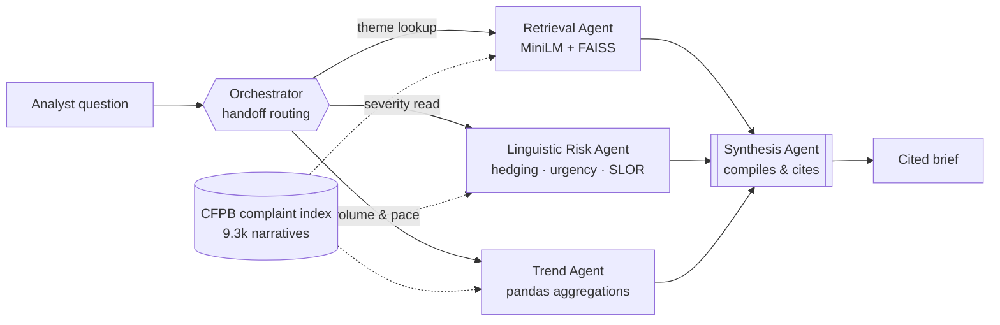

# Bank Complaint Intelligence Agent

A five-agent Semantic Kernel system that turns the public **CFPB Consumer
Complaint Database** into analyst-grade briefs — combining semantic retrieval, a
psycholinguistic risk score, and trend analysis under handoff-based routing.

Ask it a question in plain language:

> *"What are Wells Fargo customers most frustrated about with overdraft fees in
> the last two quarters, and how urgent does the language sound?"*

…and an Orchestrator routes the work to three specialists, then a Synthesis
agent compiles their findings into a short brief where **every claim carries a
complaint ID**.

Everything runs on genuinely free infrastructure. No credit card anywhere in the
chain.

---

## Architecture



The Orchestrator holds no data tools — it only decides *who* works on a
question. Specialists can hand back to it for re-routing or straight on to
Synthesis when the question is already answered, so a simple lookup skips a
routing round-trip.

| Agent | Owns | Tools |
| --- | --- | --- |
| **Orchestrator** | Intent classification and routing | `transfer_to_*` only |
| **Retrieval Agent** | The complaint index — the only agent that reads it | `search_complaints`, `dataset_scope` |
| **Linguistic Risk Agent** | Severity of complaint *language* | `score_complaints`, `score_text`, `severity_profile` |
| **Trend Agent** | Volume, issue mix, quarter-over-quarter movement | `complaint_volume`, `quarter_over_quarter`, `top_issues`, `rising_issues` |
| **Synthesis Agent** | The final brief | none — judgement only |

---

## The part that isn't a RAG wrapper

Most "AI complaint triage" demos ask an LLM how angry a complaint sounds. That
answer is unreproducible and unauditable — two things a bank cannot accept.

`nlp/linguistic_risk.py` scores each narrative with explicit, inspectable
features instead, extending coursework in computational psycholinguistics:

| Feature | What it captures |
| --- | --- |
| `urgency` | temporal-pressure and immediacy markers |
| `intensity` | negative-affect lexicon, intensifiers, shouting (caps), `!` density |
| `escalation` | legal and regulatory threat vocabulary |
| `harm` | concrete financial consequences — foreclosure, NSF, credit score |
| `repetition` | evidence of repeated, unresolved contact attempts |
| `hedging` | epistemic hedges — these **lower** the score (see below) |
| `disfluency` | low SLOR relative to the corpus |

**SLOR** (Syntactic Log-Odds Ratio — Pauls & Klein 2012; Lau, Clark & Lappin
2017) is the standard length- and frequency-controlled fluency measure:

```
SLOR(s) = ( log P_LM(s) − log P_unigram(s) ) / |s|
```

Subtracting the unigram term stops a sentence being penalised merely for
containing rare words; dividing by length stops long complaints scoring
differently from short ones. `P_LM` here comes from an add-k smoothed **bigram
model fitted on the complaint corpus itself** — cheap, dependency-free and
reproducible on a free CPU box, where a neural LM would not be. Narratives
scoring well below the corpus mean are disfluent relative to their peers, which
in written complaints tracks distress and haste.

Three design decisions worth defending in an interview:

**Hedging dampens rather than adds.** "I think there *may possibly* have been a
small error" is not an urgent complaint however annoyed the writer is. Heavy
hedging signals low speaker commitment, so it multiplies the score down by up to
25%. This is what separates *loud* from *urgent* — the distinction that actually
drives triage.

**Severity bands are calibrated, not absolute.** Consumer complaints run long, so
marker *rates* per 100 tokens are low and fixed cut-points put almost everything
in the bottom band — the first build scored 4 complaints out of 9,324 as high.
`data.ingest` now sets the bands from the corpus distribution (70th and 92nd
percentile), and every score is reported with its corpus percentile alongside the
raw value. "Top decile of urgency for this book of complaints" is an actionable
statement; "34 out of 100" is not.

**Every driver is traceable.** A score comes back with the exact tokens that
produced it, so a reviewer can disagree with the evidence rather than with a
black box.

---

## Two execution modes

`agents/orchestrator.py` runs the same five agents two ways:

- **`handoff`** — Semantic Kernel's `HandoffOrchestration`. The routing model
  decides which specialists to involve and in what order. This is the pattern
  the project is about, and the one AI-102/AI-103 examines.
- **`pipeline`** — a deterministic retrieval → risk → trend → synthesis
  sequence with no routing model in the loop.

`auto` (the default) runs handoff and falls back to pipeline if it fails or
returns nothing usable. This isn't a theoretical hedge — it's load-bearing.
Tested against a real Groq key, handoff mode fails outright on a sizeable share
of runs (see "Rate limits and model reliability" below), almost always because
of a Groq-side model-compliance glitch rather than a bug in this code, and
`auto` transparently recovers every time in testing. The UI shows which mode
actually produced the answer, plus a note when it had to fall back.

### Rate limits and model reliability, measured

Groq retired `llama-3.3-70b-versatile` at some point after this project's spec
was written; the default model is now `openai/gpt-oss-120b`. Every
tool-calling-capable model on Groq's free tier — checked directly against a real
key via `GET /openai/v1/models` and a probe request to each — shares the same
ceilings: **8,000 tokens/minute, 1,000 requests/minute, and a separate 200,000
tokens/day**. The daily cap is easy to miss until a demo session actually hits
it — the same key can run fine for an hour and then fail outright with no
per-minute warning beforehand. Groq's own agentic `compound`/`compound-mini`
models have a much higher per-minute ceiling (70,000 TPM) but reject custom
tool definitions outright (`tool calling is not supported with this model`),
so they aren't an option here regardless of budget.

That budget is tight for a 5-agent handoff pattern, where every specialist
re-reads the growing shared transcript, and it surfaces as four distinct
failure modes this project actually hit and now handles:

1. **Per-minute 429s.** Expected under this budget; Groq's own error message
   quotes a sub-second recovery time, so `kernel_setup.with_rate_limit_retry`
   retries with backoff rather than failing the turn.
2. **Per-day 429s.** Groq quotes a recovery wait here too, but it can be
   minutes long — sitting through that inside a live web request would just
   hang the UI with no feedback. Past a threshold (`_MAX_INLINE_WAIT`, 20s),
   the retry helper stops retrying and raises `QuotaExhausted` immediately with
   the actual wait quoted back, and the UI shows that plainly instead of a raw
   traceback. (An earlier version of this parser also mis-read Groq's compound
   duration format — `"3m8.352s"` — as 3 *minutes*, because a regex alternation
   matched the bare `m` before trying `ms`/`m`/`s` in the right order; it's
   covered by a unit test now.)
3. **Tool-name drift.** `gpt-oss-120b` reliably calls SK's own `transfer_to_*`
   handoff functions by their full name, but often drops the plugin prefix SK
   adds to this project's own tools — calling `search_complaints` when the
   declared name is `RetrievalTools-search_complaints`. Groq's server validates
   the model's tool call against the declared list and rejects the mismatch
   with a 400 *before SK's own, already-tolerant name resolver ever sees it*
   (`Kernel.get_function` already searches every plugin by bare name when no
   plugin prefix is given). `agents/groq_compat.py` closes that gap on the
   request side: it patches every outgoing request to declare each tool under
   both its qualified and bare name, so whichever one the model calls, Groq
   accepts it.
4. **Occasional malformed tool calls.** Rarely, `gpt-oss-120b` emits invalid
   JSON arguments, omits a required argument, or tries to call a tool on a turn
   SK had force-closed with `tool_choice: "none"`. All three are sampling
   noise, not deterministic — `with_rate_limit_retry` retries these too, and
   `answer()` restarts a failed handoff run once before giving up to pipeline.

None of this is a knock on Semantic Kernel's handoff implementation, which is
solid — it's what a genuinely free tool-calling model tier costs on Groq today.
Building around it, rather than assuming a reliable model, is the actual
engineering content here.

### Routing silently skipped — a separate, deeper issue than the budget above

The single most persistent failure across this whole project — "Task is
completed with summary: No handoff agent name provided..." — isn't caused by
Groq's tight budget above. It hit Gemini too, with none of that budget
pressure, so it has a different root cause: `FunctionChoiceBehavior.Auto()`
genuinely *permits* an agent to answer in plain text instead of calling a
tool, and no prompt wording forces compliance — it's a real option the model
is free to take, on either provider. The fix isn't a patch, it's a policy
change: [agents/kernel_setup.py](agents/kernel_setup.py) now runs the
Orchestrator and all three specialists — every one of which is designed to
always end its turn by calling a domain tool or a `transfer_to_*` — with
`FunctionChoiceBehavior.Required()` instead, which maps to a genuinely forced
tool call (Gemini's `function_calling_config.mode = "ANY"`; a forced
`tool_choice` on Groq's OpenAI-shaped API). SynthesisAgent is the deliberate
exception — its entire job is answering in prose, so it keeps `Auto()`.

Two structural gaps compounded this on the Gemini side specifically, both real
bugs independent of the model itself: every specialist's prompt covered
routing to *another specialist* for more analysis, but never covered "I have
nothing further to add" — so a specialist invoked a second time (e.g.
Retrieval, asked to fetch examples for a trend Trend already found) would just
summarize in prose and end the run with no transfer at all. And SynthesisAgent
had *zero* outgoing edges in the handoff graph despite the Orchestrator being
allowed to route to it as the very first move — so if that happened before any
specialist had gathered real evidence, Synthesis's only option was to give up
via `complete_task` with no way to ask for real routing first. Both are fixed
now: every specialist is explicitly told to close out to Synthesis, and
Synthesis can hand back to the Orchestrator when it's reached with nothing to
work with.

### Switching providers — Groq, Google AI Studio, or Azure OpenAI

`config.LLM_PROVIDER` (env var, default `groq`) selects which LLM backs every
agent — `groq`, `google`, or `azure`. The switch touches nothing outside
[agents/kernel_setup.py](agents/kernel_setup.py): every agent, tool, and the
handoff graph are provider-agnostic.

`google` switches the whole team to Gemini via Google AI Studio, through
Semantic Kernel's own native `GoogleAIChatCompletion` connector — no
OpenAI-shim trick needed there, since Google (like Anthropic) ships a
first-party SK connector rather than mimicking OpenAI's wire format.

```bash
pip install "google-genai>=1.51,<1.75"   # not needed for the default Groq path
export LLM_PROVIDER=google
export GOOGLE_AI_API_KEY=...             # free key: https://aistudio.google.com
python app.py
```

**A real bug this surfaced, and its fix.** The first live test against a real
key hit a hardcoded `role="function"` in Semantic Kernel 1.44.1's own
`GoogleAIChatCompletion._prepare_chat_history_for_request` (the latest
published SK release at the time — no newer version exists to pull the fix
from) — Google's current API rejects that role outright: `400 ... "Role
'function' is not supported. Please use a valid role: SYSTEM, ..., MODEL,
USER."` [agents/google_compat.py](agents/google_compat.py) subclasses the
connector with just that one line changed to `role="user"` — the role
Gemini's own function-calling convention uses for returning a tool result —
everything else in the connector (request building, response parsing,
streaming) is untouched. `kernel_setup.py`'s Google branch uses this patched
class transparently; nothing above it needs to know the patch exists.

Two things this still hasn't been validated against, since they need a real
Google key and a genuinely completed run to observe:

- **Handoff-mode reliability end-to-end.** The role bug above is now fixed,
  but the *other* failure modes that made Groq's `gpt-oss-120b` unreliable for
  handoff — dropped tool-name prefixes, malformed JSON arguments, ignoring a
  forced stop — are separate, model-specific quirks nobody documents. Gemini
  may or may not hit any of them; only a full live run says for sure.
- **The exact free-tier rate limits and the `Retry-After` shape of a real 429.**
  `with_rate_limit_retry` recognizes Google's error types by reading the
  `google-genai` package's source (`google.genai.errors.APIError.code`), but
  the wait-time parsing for Google (a `Retry-After` header guess) is unverified
  against an actual captured error, unlike Groq's regex, which is tuned
  against real ones. Check your account's actual limits at
  `aistudio.google.com/rate-limit` rather than assuming Groq's shape carries over.

`azure` points the whole team at your own Azure OpenAI deployment, through
SK's native `AzureChatCompletion` connector. This is the simplest of the three
providers to wire up: Azure OpenAI's wire format *is* OpenAI's, so it needs no
compatibility shim (unlike Groq) and no new dependency (unlike Google) — the
`openai` package this project already depends on ships `AsyncAzureOpenAI`, and
Azure's errors are the same `openai.RateLimitError` / `openai.APIError` types
the retry logic already handles.

```bash
export LLM_PROVIDER=azure
export AZURE_OPENAI_API_KEY=...      # never put this in config.py
export AZURE_DEPLOYMENT=your-deployment-name  # optional, defaults to what's in config.py
python app.py
```

The endpoint is the one piece of Azure configuration that lives in
[config.py](config.py) (`AZURE_ENDPOINT`) rather than an env var — deliberately:
it's project-specific configuration visible in your own Azure portal, not a
secret, unlike the API key. `AZURE_DEPLOYMENT` is your own deployment's alias
(e.g. `gpt-6-astra`) — a name you chose in Azure AI Foundry, not a public
model name, so there's no "is this still current" check to run the way there
is for `GROQ_MODEL`/`GOOGLE_MODEL`.

## Running it

```bash
git clone <this repo> && cd bank-complaint-agent
python -m venv .venv && .venv/Scripts/activate     # Linux/macOS: source .venv/bin/activate
pip install -r requirements.txt

python -m data.fetch_cfpb      # pulls ~10k complaints from the CFPB API (no key needed)
python -m data.ingest          # cleans, fits the corpus LM, scores, embeds, builds FAISS

export GROQ_API_KEY=gsk_...    # free key: https://console.groq.com/keys
python app.py                  # http://localhost:7860
```

The **Explore** and **Dashboard** tabs work with no API key at all — semantic
search and the risk scorer are entirely local. Only the agent team needs Groq.

Useful flags:

```bash
python -m data.fetch_cfpb --list-companies schwab   # resolve exact CFPB company names
python -m data.fetch_cfpb --company "STATE FARM BANK, FSB" --max 2000
python -m data.ingest --rebuild --reuse-embeddings  # re-score without re-embedding
python -m agents.orchestrator "Are Amex disputes getting worse?"
```

Scope lives in [`config.py`](config.py) — companies, date window and the
minimum narrative length.

---

## Tech stack

| Layer | Choice | Cost |
| --- | --- | --- |
| Data | CFPB Complaint Database API | $0 · no key |
| Embeddings | `all-MiniLM-L6-v2`, local | $0 |
| Vector index | FAISS `IndexFlatIP` (cosine, exact) | $0 |
| Orchestration | Semantic Kernel (Python) | $0 |
| LLM | Groq · `openai/gpt-oss-120b` | $0 free tier |
| App | Gradio | $0 |
| Hosting | Render, free Python web service | $0 |

Free tiers were a deliberate constraint, not a limitation — they force the
design decisions that make the system defensible: local deterministic scoring
instead of LLM-judged severity, exact search instead of an approximate index
that needs tuning, and a fallback path for when the inference tier rate-limits.

---

## Deploying

**Hugging Face Spaces now requires a paid (Pro) plan to create a Gradio or
Docker Space** — only Static Spaces are free (verified against HF's own docs;
this changed at some point after this project's spec was written, when Spaces
were free on CPU Basic hardware regardless of SDK). The one free-tier
exception, ZeroGPU, doesn't fit here: it requires an account older than 30
days and exists for GPU-bound demos, not this app's CPU-only workload. If you
have HF Pro already, the original steps still work:

1. **New Space → Gradio SDK → CPU Basic**.
2. Push this repo to the Space, or connect the GitHub repo directly.
3. Add `GROQ_API_KEY` under **Settings → Variables and secrets**. Never commit it.
4. The built index in `index/` is committed (~33 MB), so the Space boots without
   re-fetching CFPB data. `index/embeddings.npy` is *not* committed — those
   vectors already live inside `complaints.faiss` and are reconstructed at load
   time. To keep the repo lean instead, uncomment `index/` in `.gitignore` and
   run the two build commands on first boot — expect a slow cold start.
5. Free Spaces sleep when idle. Open the link a minute before demoing.

### Deploying for free instead — Render

[Render](https://render.com)'s free tier hosts a native Python web service (no
Docker required), with no card needed to get started:

1. Push this repo to GitHub (see below), then at [render.com](https://render.com):
   **New → Web Service → connect the GitHub repo**.
2. **Build command:** `pip install -r requirements.txt`
   **Start command:** `python app.py`
   (`app.py` already reads Render's `PORT` env var — see [app/app.py](app/app.py).)
3. Add `GROQ_API_KEY` under the service's **Environment** tab.
4. Render's free tier spins the service down after 15 minutes idle and takes
   about a minute to wake back up on the next request — the same "warm it up
   before demoing" tradeoff as HF's free tier, on a host that doesn't require
   a paid plan to run a Gradio app at all.

---

## Repo layout

```
bank-complaint-agent/
├── config.py                  # paths, dataset scope, model ids
├── app.py                     # HF Spaces entry point
├── data/
│   ├── fetch_cfpb.py          # pulls & caches complaints from the CFPB API
│   └── ingest.py              # cleaning, LM fit, scoring, FAISS build + ComplaintIndex
├── nlp/
│   ├── embeddings.py          # sentence-transformers wrapper
│   └── linguistic_risk.py     # hedging / urgency / harm / SLOR scoring
├── agents/
│   ├── kernel_setup.py        # Semantic Kernel wiring, provider switch, retry/backoff
│   ├── groq_compat.py         # Groq tool-call name compatibility shim (see README)
│   ├── google_compat.py       # Gemini role="function" bug fix (see README)
│   ├── orchestrator.py        # handoff graph, pipeline fallback
│   ├── retrieval_agent.py
│   ├── risk_agent.py
│   ├── trend_agent.py
│   └── synthesis_agent.py
├── app/app.py                 # Gradio chat + explorer + dashboard
├── requirements.txt
└── index/                     # built artefacts (committed so the Space boots cold)
```

---

## Notes and limitations

- **Pagination.** The CFPB search API documents a `frm` offset parameter that is
  silently ignored — every offset returns the same first page. `fetch_cfpb.py`
  pages by *date window* instead, requesting each month whole.
- **Groq via Semantic Kernel.** SK's `OpenAIChatCompletion` has no `base_url`
  argument, so Groq is reached by injecting an `openai.AsyncOpenAI` client built
  against Groq's base URL. That is the only provider-specific line in the project
  ([`agents/kernel_setup.py`](agents/kernel_setup.py)).
- **Publication lag.** CFPB publishes narratives on a delay, so the newest weeks
  are thin. The Trend agent flags an incomplete quarter and reports daily pace
  rather than letting a partial period read as a decline.
- **Scope.** The default build covers Wells Fargo, American Express and Charles
  Schwab over the trailing four quarters — 9,307 narratives of 50+ words.
  Widening it is a `config.py` edit and a rebuild.
- **What the risk score is not.** It measures the *language* of a complaint, not
  its merit. A calm, well-founded complaint scores low; an angry, baseless one
  scores high. It is a triage signal, not a finding about any company or
  complainant.

Data: CFPB Consumer Complaint Database, public domain.
